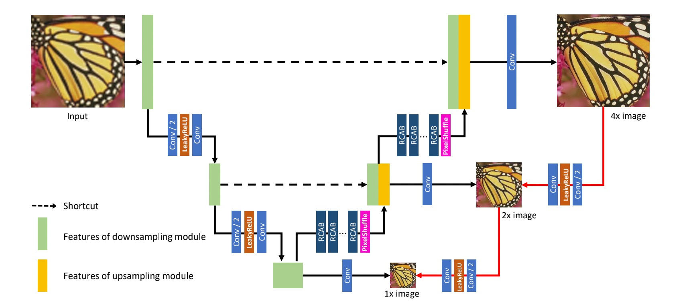
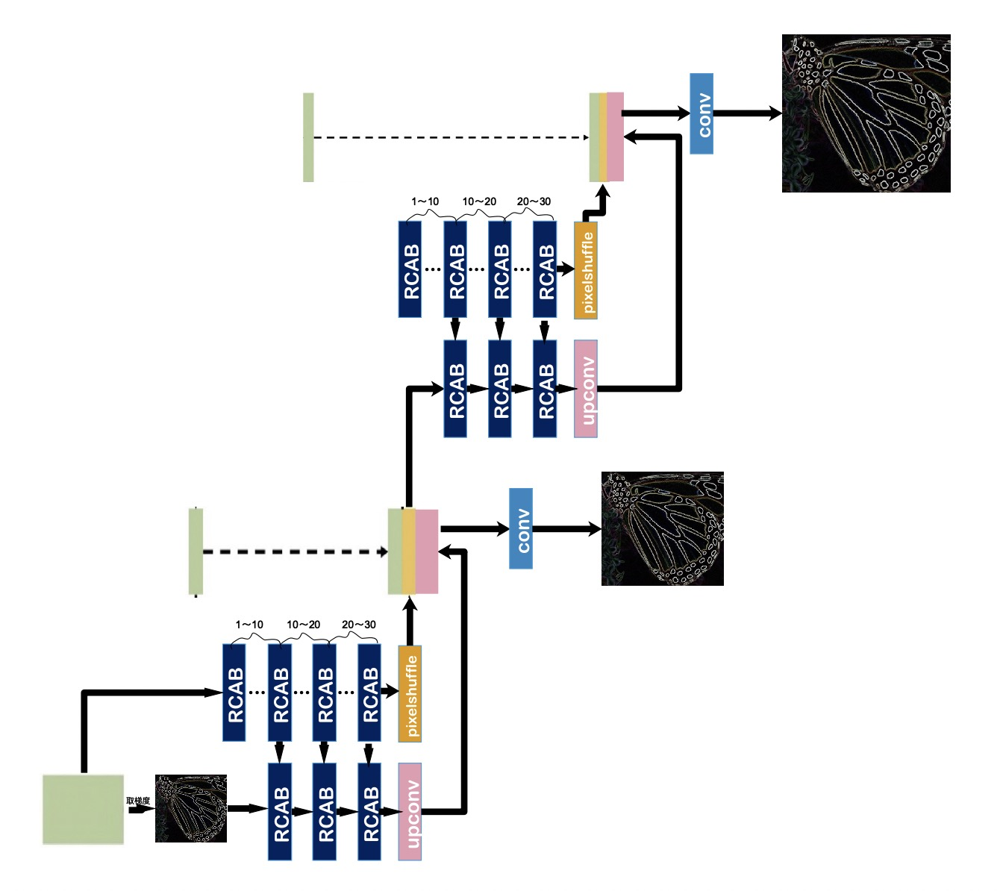

## 图像超分


## 代码结构 

```
|---- data
|    |---- dfflickr2k_place.py                   自定义自己的数据读取加载格式
     ....                                        其他数据加载基本定义
|---- data_scripts                                数据预处理操作，生成低分辨率图、提取patch
                                

|---- model                                       模型定义
|    |---- 
|    |---- 
     ....                                                       


|---- checkpoint.py
|---- loss.py
|---- option.py                               训练时对可选参数的定义
|---- utility.py
|---- trainer.py                              训练/测试函数定义
|---- main.py                              
|---- predict.py                                 分块预测
|---- split_patch.py
```

不加梯度分支的网络结构:
 

梯度分支的网络结构:
 


## 运行环境 

或者根据requirements.txt安装环境
```
pip install -r requirements.txt

```

## 运行Demo
### 训练
根据option.py 在main***.sh中定义相应的参数值
部分main***.sh参数解析
```
export CUDA_VISIBLE_DEVICES=0
nohup python -u main.py \
// 定义数据集所在位置
--data_dir="" \
// 定义训练数据加载方式 （目前只用这一种加载方式即可，满足DIV2K,Flick和unpaired数据集加载）       
--data_train="DFFlickr2K_Place" \
// 定义valid数据集加载方式
--data_test="DFFlickr2K_Place" \
//对数据进行数据增强操作（加噪声模糊等）
--add_noise \
// 训练数据中加入unpaired数据集
--add_unsupervised \
// 模型中加入梯度分支
--add_gradient_branch \
// 定义loss的组成成分及对应的权重，loss函数的量化形式，不要某种类型的loss时定义其权重为0
--loss='1*primary_L1+0.1*dual_L1+0*perceptual_L1+0*tv_TV+0.05*gradientpixel_MSE+0.5*gradientbranch_L1' \
// 定义上采样的尺度
--scale=4 \
// 模型输入patch的大小
--patch_size=192 \
// 采用bic退化模型的低分辨率数据进行训练
--Degenerate_type='bic' \
// 采用DRN-S模型（模型相对较小）
--model="DRN-S" \
// 预训练模型
--pre_train="./log/DRN-Sx4_bic_perceptual/model/model_best.pt" \
// 定义验证的频次，每迭代1000次验证一次
--test_every=1000 \
// 定义训练的epoch数
--epochs=1000 \
// 定义batch_size
--batch_size=20 \
// 定义学习率
--lr=0.0001 \
// 定义log存储位置
--save="./log/DRN-Sx4_unsupervised_bic_gradientbranch/" \
// 验证时保存结果
--save_results \
// 定义打印频次，每迭代20次打印一次日志
--print_every=20 \
> out_unsupervised_bic_gradientbranch.log 2>&1 & 


```

### 训练
```
sh main**.sh
```

### 测试

```
python predict.py

```


